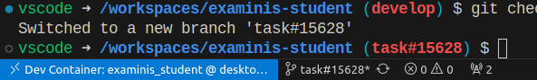

# README

Este README cobre os passos mais importantes para que seja possível rodar o projeto Ruby on Rails
referente ao módulo do aluno (*student*) da aplicação Examinis.

## O que eu devo ter na minha máquina antes de começar?

Antes de começar a configurar o projeto na sua máquina, certifique-se que você tem os seguintes
softwares instalados:
- Docker ([site para baixar o Docker](https://www.docker.com/))
- Visual Studio Code ([site para baixar o VSCode](https://code.visualstudio.com/))
    - é recomendado adicionar o VSCode ao PATH durante a instalação (no Windows, essa opção é mostrada durante a instalação)
- Apenas para Windows - Windows Subsystem for Linux ([instruções para instalação](https://learn.microsoft.com/en-us/windows/wsl/install))
- No Visual Studio Code - o pack de extensões "Remote Development" ([link para a extensão](https://marketplace.visualstudio.com/items?itemName=ms-vscode-remote.vscode-remote-extensionpack))

## Configurando o projeto

Antes de começar este passo a passo, lembre-se de verificar se todas as dependências citadas no passo
anterior foram instaladas corretamente.

1. Clone o repositório deste projeto em sua máquina
```sh
# Using SSH
git clone git@github.com:Examinis/examinis-student.git
# Using HTTPS
git clone https://github.com/Examinis/examinis-student.git
```
2. Inicialize o Docker em sua máquina (ao abrir o Docker Desktop, isso já é feito).

1. Abra este projeto no Visual Studio Code através da interface gráfica (open folder) ou, caso seu
VSCode tenha sido adicionado ao PATH, utilize o comando `code caminho/para/o/diretorio`.

1. Assim que o projeto for aberto, a extensão "Dev Containers" (incluída no pack de extensões "Remote development")
fará com que um popup seja aberto:


    Desse modo, selecione a opção *Reopen in Container*

    Outra alternativa a selecionar a opção anterior é abrir a paleta de comandos do VSCode (aperte F1) e
digitar *Dev Containers: Rebuild and Reopen in Container* (provavelmente, o autocomplete fará o seu
trabalho antes que você termine de digitar tudo).

## Executando a aplicação em sua máquina

1. Dica: antes de começar a executar suas aplicações, pare a instância do seu *PostgreSQL* local (
caso haja uma) executando o comando `sudo pkill -u postgres`, visto que, em alguns momentos, ter 
tal insância rodando resulta em um conflito de portas.

1. Certifique-se de que a [API FastAPI](https://github.com/Examinis/examinis-api) está executando.

1. Obtenha o IP da aplicação *FastAPI* executando o comando `docker network inspect examinis_network`.
    - O IPv4 pode ser obtido no seguinte trecho:
    ```json
    "Containers": {
            ...

            "8f093d17b7921f84420d500e6ae5436a6148544a2eac6b29c40b6687401c802d": {
                "Name": "examinis_api",
                "EndpointID": "04c798d740f3956389324344d6911c12c29ab0c639a46e28ce6e80ee21baf842",
                "MacAddress": "02:42:ac:16:00:03",
                "IPv4Address": "172.22.0.3/16", // Este é o endereço que estamos procurando
                "IPv6Address": ""
            },

            ...
        },
    ```

1. Crie um arquivo `.env` na raíz do projeto.

1. Para o arquivo `.env`, siga a mesma estrutura do arquivo `.env.example`.
    ```env
    API_URL=http://example.com/api
    ```

1. Após garantir revisar os passos de configuração do projeto, abra um terminal dentro do próprio VSCode, visto que vamos executar os comandos dentro do container:
    ```sh
    # Utilizamos este comando para executar a aplicação por conta da estilização
    ./bin/rails restart && ./bin/rails assets:clobber && ./bin/rails assets:precompile && ./bin/dev
    ```

## Adicionando novas Gems ao projeto

1. Dentro do VSCode, certifique-se de que a aplicação está aberta em um "Dev Container":

    

1. No terminal do container, digite o comando `bundle add {nome_da_gem}`.

## Instalando Gems após fazer o `git pull`

Em algum momento, algum membro pode adicionar uma nova dependência ao projeto (uma nova *gem* no `Gemfile`) e, quando um outro membro da equipe puxar
as novas alterações, este não terá essa *gem* instalada em seu ambiente. Portanto, para instalar as *gems* em seu ambiente, rode o comando `./bin/bundle install`.

## Estilo de codificação

O código-fonte deste projeto foi todo desenvolvido em inglês (inclusive os comentários e as entidades). Dessa maneira,
a fim de manter a consistência, codifique em inglês.

## TODO - o que precisamos adicionar neste README?

* Versão do Ruby

* Criação do banco de dados

* Inicialização do banco de dados

* Como rodar a suíte de testes

* Serviços (filas de trabalho, servidores de cache, motores de busca, etc.)

* Instruções de deploy