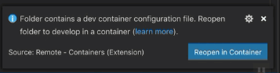

# README

Este README cobre os passos mais importantes para que seja possível rodar o projeto Ruby on Rails
referente ao módulo do aluno (*student*) da aplicação Examinis.

## O que eu devo ter na minha máquina antes de começar?

Antes de começar a configurar o projeto na sua máquina, certifique-se que você tem os seguintes
softwares instalados:
- Docker ([site para baixar o Docker](https://www.docker.com/))
- Visual Studio Code ([site para baixar o VSCode](https://code.visualstudio.com/))
    - é recomendado adicionar o VSCode ao PATH durante a instalação (no Windows, essa opção é mostrada durante a instalação)
- Apenas para Windows - Windows Subsystem for Linux ([instruções para instalação](https://learn.microsoft.com/en-us/windows/wsl/install))
- No Visual Studio Code - o pack de extensões "Remote Development" ([link para a extensão](https://marketplace.visualstudio.com/items?itemName=ms-vscode-remote.vscode-remote-extensionpack))

## Configurando o projeto

Antes de começar este passo a passo, lembre-se de verificar se todas as dependências citadas no passo
anterior foram instaladas corretamente.

1. Clone o repositório deste projeto em sua máquina
```sh
# Using SSH
git clone git@github.com:Examinis/examinis-student.git
# Using HTTPS
git clone https://github.com/Examinis/examinis-student.git
```

2. Abra este projeto no Visual Studio Code através da interface gráfica (open folder) ou, caso seu
VSCode tenha sido adicionado ao PATH, utilize o comando `code caminho/para/o/diretorio`.

3. Assim que o projeto for aberto, a extensão "Dev Containers" (incluída no pack de extensões "Remote development")
fará com que um popup seja aberto:


    Desse modo, selecione a opção *Reopen in Container*

    Outra alternativa a selecionar a opção anterior é abrir a paleta de comandos do VSCode (aperte F1) e
digitar *Dev Containers: Rebuild and Reopen in Container* (provavelmente, o autocomplete fará o seu
trabalho antes que você termine de digitar tudo).

## Estilo de codificação

O código-fonte deste projeto foi todo desenvolvido em inglês (inclusive os comentários e as entidades). Dessa maneira,
a fim de manter a consistência, codifique em inglês.

## TODO - o que precisamos adicionar neste README?

* Versão do Ruby

* Criação do banco de dados

* Inicialização do banco de dados

* Como rodar a suíte de testes

* Serviços (filas de trabalho, servidores de cache, motores de busca, etc.)

* Instruções de deploy